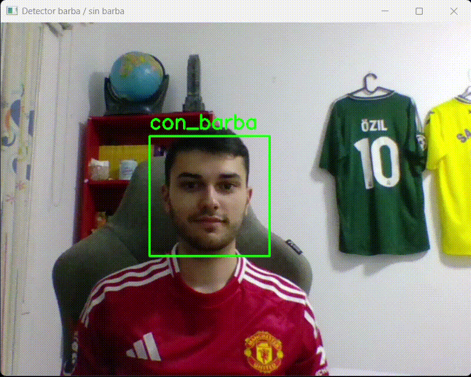

# Visión por computador - Práctica V
## Autores
 - Juan Carlos Rodríguez Ramírez
 - Mohamed O. Haroun Zarkik

## Introducción

## Entorno y librerías
Para el funcionamiento de esta práctica será necesario tener un entorno con las siguientes dependencias:

```bash
conda create --name VC_P5 python=3.11.5
conda activate VC_P5

pip install opencv-python matplotlib imutils mtcnn tensorflow deepface tf-keras cmake

pip install scikit-learn
pip install scikit-image
```

## Tarea I

Se pide desarrollar un prototipo biométrico, es decir, entrenar un modelo extrayendo características biométricas de las imágenes y detectar algo en función de las extraídas. Algo así como un discriminador. En este caso, se ha realizado un discriminador binario para detectar si una persona tiene o no barba. Para ello, se emplearon los datasets de [CelebA](https://www.kaggle.com/datasets/jessicali9530/celeba-dataset) (200.000+ imágenes de celebridades) y [Beard or No Beard](https://www.kaggle.com/datasets/uzair01/beard-or-no-beard) (~300 imágenes discriminando famosos con barba más notable y sin). Del primer dataset, se hizo una selección manual de unas 270 imágenes de personas con barba y sin barba, buscando que no fuesen barbas muy variantes y sobre todo notables. El punto de la tarea es que detecte barba, no que se confunda con la cantidad de tamaños de barba, colores y formas (bigotes, candado, perilla...). 

En un principio, el modelo parecía necesitar más imágenes; se comenzó entrenando el modelo con un 95% de PCA, HOG y LBP, con un tamaño de imágenes reescalado a 128x128 píxeles. Tras probar el modelo tanto con la cámara como con inferencias, no se consiguió detectar ninguna barba, lo cual podía indicar falta de imágenes. 

No obstante, se optó por subir la calidad del reescalado a 192x192 píxeles, con la intención de que con más calidad, el resultado fuese mejor. No se obtuvo mejora alguna, lo que empezó a mosquearnos, ya que haciendo inferencias con las propias imágenes de entrenamiento, no se conseguía la detección de personas con barbas. Después de mucho razonamiento y una pequeña charla con el profesor Modesto Castrillón, se consiguió detectar el error, y se solventaron otros problemas relacionados.   

### Problema detectado

Durante las pruebas se observó que el clasificador:

- Apenas detectaba casos **con barba**, incluso sobre imágenes del propio conjunto de entrenamiento.  
- Funcionaba aceptablemente en validación cruzada (k‑fold), pero se comportaba casi como un clasificador constante en la demo (webcam e inferencias). 

#### Resultados de validación cruzada (5 folds)

| Esquema        | Accuracy Fold 1 | Accuracy Fold 2 | Accuracy Fold 3 | Accuracy Fold 4 | Accuracy Fold 5 | Accuracy media |
|----------------|-----------------|-----------------|-----------------|-----------------|-----------------|----------------|
| PCA + SVM      | 0.71            | 0.72            | 0.71            | 0.73            | 0.73            | 0.72           |
| HOG + SVM      | 0.70            | 0.60            | 0.68            | 0.68            | 0.72            | 0.68           |
| LBP + SVM      | 0.76            | 0.72            | 0.71            | 0.81            | 0.79            | 0.76           |

***

Analizando el código se identificaron dos causas principales:

1. **Incoherencia entre entrenamiento e inferencia (falta de escalado):**  
   - En el entrenamiento, los descriptores (PCA, HOG, LBP) se normalizaban con `MinMaxScaler` antes de entrenar el SVM.  
   - En las inferencias (imagen estática y webcam) se calculaba HOG/LBP, pero se pasaban directamente al SVM sin aplicar el mismo escalado.  
   - El modelo recibía vectores en un rango distinto al de entrenamiento, lo que explica que, incluso con imágenes conocidas, tendiera a una sola clase.

2. **Recorte de cara con poco contexto en la demo:**  
   - El dataset de entrenamiento contiene caras con cierto contexto (parte de cabeza, cuello y algo de fondo).  
   - En la demo, Viola–Jones devolvía un bounding box muy ajustado a la cara, que después se reescalaba directamente, perdiendo parte de la silueta y del contexto que el modelo había visto durante el entrenamiento.  
   - Esta diferencia de distribución entre las imágenes de entrenamiento y las de la webcam degradaba aún más el rendimiento.

***

### Cambios realizados

#### 1. Coherencia entrenamiento–inferencia: guardar y aplicar el scaler

**Antes:**

- En el entrenamiento:  
  ```python
  scaler = MinMaxScaler()
  train_X = scaler.fit_transform(X_train)
  test_X  = scaler.transform(X_test)
  clf = GridSearchCV(SVC(...))
  clf = clf.fit(train_X, y_train)
  ```
- En la inferencia:  
  - Se calculaba el descriptor LBP/HOG y se llamaba a `svm_lbp.predict(desc)` sin normalizar.

**Posteriormente:**

1. **Entrenamiento: la función de predicción devuelve también el scaler**

   ```python
   def GetPredictions(X_train, X_test, y_train, y_test):
       scaler = MinMaxScaler()
       train_X = scaler.fit_transform(X_train)
       test_X  = scaler.transform(X_test)

       parameters = {'C': [1e3, 5e3],
                     'gamma': [0.0001, 0.0005, 0.001, 0.005, 0.01]}
       clf = GridSearchCV(SVC(kernel='rbf', class_weight='balanced'),
                          parameters, cv=5)
       clf = clf.fit(train_X, y_train)

       y_pred = clf.predict(test_X)
       return y_pred, y_test, clf, scaler
   ```

2. **En el bucle k‑fold se guarda también el scaler del mejor modelo (en nuestro caso, LBP+SVM):**

   ```python
   y_pred_lbp_svm, y_test_lbp_svm, svm_lbp, scaler_lbp = GetPredictions(
       Xlbp3x3_train, Xlbp3x3_test, y_train, y_test
   )

   if fold == 1:
       joblib.dump(svm_lbp,   "svm_lbp_barba.joblib")
       joblib.dump(scaler_lbp,"scaler_lbp_barba.joblib")
   ```

3. **Inferencias: se aplica el mismo scaler antes de `predict`**

   ```python
   svm_lbp    = joblib.load("svm_lbp_barba.joblib")
   scaler_lbp = joblib.load("scaler_lbp_barba.joblib")

   def preprocess_lbp_from_gray(gray):
       gray_resized = cv2.resize(gray, (WIDTH, HEIGHT),
                                 interpolation=cv2.INTER_AREA)
       feat_lbp = lbphist(gray_resized,
                          ncellsx=3, ncellsy=3,
                          width=WIDTH, height=HEIGHT,
                          lbp_method="nri_uniform")
       desc = feat_lbp.astype("float32").reshape(1, -1)
       desc_scaled = scaler_lbp.transform(desc)
       return desc_scaled
   ```

   - Esta función se utiliza tanto en las inferencias sobre imágenes del dataset como en el flujo de *webcam*.  
   - Con esto, el SVM recibe exactamente el mismo tipo de datos (mismo rango y distribución) que durante el entrenamiento.

**Efecto:** Tras este cambio, el modelo vuelve a comportarse en inferencia de forma coherente con los resultados de k‑fold y es capaz de clasificar correctamente muchas imágenes con barba, incluidas las del propio dataset.

***

#### 2. Aumento del bounding box para incluir contexto

**Antes:**

- En la demo con webcam:  
  - Viola–Jones detectaba una cara con `(x, y, w, h)`.  
  - Se recortaba exactamente ese rectángulo y se reescalaba a `WIDTH × HEIGHT` para calcular LBP.  
  - El modelo había sido entrenado con imágenes donde la cara aparecía con algo más de contexto (cabeza/cuello/fondo), por lo que la distribución de píxeles no coincidía.

**Posteriormente:**

1. **Se define una función para expandir el bounding box alrededor de la cara:**

   ```python
   def expand_bbox(x, y, w, h, frame_width, frame_height, factor=1.3):
       cx = x + w / 2.0
       cy = y + h / 2.0
       new_w = w * factor
       new_h = h * factor

       x_new = max(0, int(cx - new_w / 2.0))
       y_new = max(0, int(cy - new_h / 2.0))
       x_new2 = min(frame_width,  int(x_new + new_w))
       y_new2 = min(frame_height, int(y_new + new_h))

       return x_new, y_new, x_new2 - x_new, y_new2 - y_new
   ```

2. **En el bucle de la webcam se usa el bbox expandido y el mismo preprocesado que en entrenamiento:**

   ```python
   faces = face_cascade.detectMultiScale(frame_gray,
                                         scaleFactor=1.3,
                                         minNeighbors=5)

   for (x, y, w, h) in faces:
       x_exp, y_exp, w_exp, h_exp = expand_bbox(
           x, y, w, h, w_frame, h_frame, factor=1.3
       )

       face_gray = frame_gray[y_exp:y_exp+h_exp, x_exp:x_exp+w_exp]

       desc_scaled = preprocess_lbp_from_gray(face_gray)
       pred  = int(svm_lbp.predict(desc_scaled)[0])
       label = classlabels[pred]
       ...
   ```

El dataset de entrenamiento contiene caras con contexto, no recortes extremadamente ajustados, por lo que LBP está captando textura de barba pero también forma global de la mandíbula, cuello y parte del fondo. Al ampliar el bounding box, las imágenes de la webcam se parecen más a las del entrenamiento (tipo de recorte, proporción de cara/fondo), reduciendo el desajuste entre ambos dominios.

**Efecto:** Con el bounding box expandido y el preprocesado coherente, el sistema pasa de prácticamente no detectar barbas en tiempo real a producir predicciones razonables, en línea con las métricas de validación cruzada.

*** 

### Resultados de la tarea I

En la validación cruzada k‑fold se entrenan `k` modelos distintos por esquema, pero para el despliegue solo es necesario conservar un modelo representativo.

La validación cruzada se utiliza para estimar de forma fiable el rendimiento medio de cada combinación de características y clasificador (PCA, HOG, LBP + SVM), no para almacenar simultáneamente todos los modelos generados en los distintos folds. En cada fold se entrena un SVM con su correspondiente `MinMaxScaler` y, dado que las particiones son estratificadas y el conjunto de datos está equilibrado, los resultados obtenidos son muy similares entre folds (accuracy en el intervalo 0.70–0.80). 

Por simplicidad, se decidió guardar el modelo y el scaler obtenidos en el primer fold, que se consideran representativos del comportamiento global observado en los experimentos, mientras que el resto de folds se emplean únicamente para calcular métricas y analizar la variabilidad. En un escenario de producción, una vez identificado el mejor esquema (en este caso LBP + SVM), lo más adecuado sería reentrenar un único modelo con todo el conjunto de datos y desplegar ese modelo final, pero para esta práctica resulta suficiente utilizar el modelo del primer fold y mantener el código más sencillo. El cuarto fold es el mejor posible, pero la diferencia no es tan significativa.  

En conjunto, los resultados muestran que el modelo LBP + SVM es capaz de diferenciar personas con y sin barba en la mayoría de los casos, obteniendo un rendimiento superior al de las alternativas basadas en PCA y HOG tanto en accuracy como en f1‑score.

#### f1-score medio por clase (aprox.)

| Esquema    | con_barba (f1) | sin_barba (f1) |
|------------|----------------|----------------|
| PCA + SVM  | ≈ 0.72         | ≈ 0.72         |
| HOG + SVM  | ≈ 0.69         | ≈ 0.66         |
| LBP + SVM  | ≈ 0.77         | ≈ 0.74         |

#### GIF demostración



# Tarea II: Aplicación de Filtros en Tiempo Real

Este notebook (`VC_P5_B_filtro.ipynb`) representa el producto final de la práctica. Aquí unimos el **clasificador biométrico** (entrenado en la Tarea I) con técnicas de **Realidad Aumentada** para aplicar filtros tipo *Snapchat* (Super Saiyan o Kawaii) dependiendo de si el usuario tiene barba o no.

A continuación, se detalla la implementación paso a paso.

## 1. Carga de Librerías, Modelos y Configuración Inicial

En este bloque inicializamos el entorno. Es fundamental cargar no solo las librerías de visión (`cv2`, `dlib`), sino también el **Scaler** (`scaler_lbp`) junto con el **SVM**. 

> **Nota Didáctica:** Si no cargamos el scaler utilizado durante el entrenamiento, los descriptores LBP que calculemos sobre la imagen de la webcam tendrán una escala diferente a la que espera el SVM, resultando en predicciones erróneas.

```python
import cv2
import numpy as np
import joblib
import dlib
from skimage import feature

# Carga de modelos
SVM_PATH = "models/svm_lbp_barba.joblib"
SCALER_PATH = "models/scaler_lbp_barba.joblib"

try:
    svm_lbp = joblib.load(SVM_PATH)
    scaler_lbp = joblib.load(SCALER_PATH)
except FileNotFoundError:
    print(f"No se encuentran los modelos en {SVM_PATH} o {SCALER_PATH}")
    exit()

# Dimensiones esperadas por el modelo (deben coincidir con el entrenamiento)
WIDTH, HEIGHT = 192, 192
CLASS_LABELS = ["con_barba", "sin_barba"]
```

## 2. Configuración del Detector Facial Geométrico

Para realizar realidad aumentada creíble, no basta con un recuadro (bounding box); necesitamos saber exactamente dónde están los ojos, la nariz y la barbilla. Para ello utilizamos **Dlib**.

* **Detector:** Localiza la cara en la imagen.
* **Predictor:** Localiza 68 puntos clave (*landmarks*) dentro de esa cara.

```python
# Configuración de dlib
detector_dlib = dlib.get_frontal_face_detector()
LANDMARKS_PATH = "shape_predictor_68_face_landmarks.dat"
try:
    predictor_dlib = dlib.shape_predictor(LANDMARKS_PATH)
except RuntimeError:
    print(f"[ERROR] Falta '{LANDMARKS_PATH}'.")
    exit()
```

## 3. Funciones de Soporte (Resumen)

Antes del bloque principal, se definen varias funciones auxiliares encargadas del procesamiento matemático y de imagen:

1.  **`lbphist` y `preprocess_lbp_from_gray`**: Son **idénticas** a las usadas en el entrenamiento. Se encargan de redimensionar el recorte de la cara a 192x192, calcular el histograma de patrones binarios locales (textura) y normalizar los datos con el scaler.
2.  **`overlay_image_alpha`**: Esta función es el motor gráfico. Permite superponer imágenes PNG (como el pelo o los ojos) sobre el video de la webcam respetando el **canal Alpha** (transparencia). Calcula las intersecciones para evitar errores si el filtro se sale de la pantalla.
3.  **`get_largest_face_dlib`**: Encapsula la lógica de Dlib. Convierte el frame a escala de grises, detecta las caras y, si hay varias, selecciona la más grande (la más cercana a la cámara) para devolver su rectángulo y sus 68 puntos clave.

## 4. Bucle Principal: Lógica de Realidad Aumentada

La función `main()` orquesta todo el proceso. A continuación, desglosamos su lógica interna en tres fases críticas: **Preparación**, **Predicción Biométrica** y **Renderizado de Filtros**.

### Fase A: Carga de Assets y Bucle de Video
Cargamos las imágenes de los filtros asegurándonos de leer el canal de transparencia (flag `-1`).

```python
def main():
    img_saiyan = cv2.imread("filter_assets/super_saiyan_hair.png", -1)
    img_kawaii_hair = cv2.imread("filter_assets/anime_girl_hair.png", -1)
    img_kawaii_eyes = cv2.imread("filter_assets/anime_girl_eyes.png", -1)

    cap = cv2.VideoCapture(0)
    print("Iniciando Filtro Final. Pulsa ESC para salir.")

    while True:
        ret, frame = cap.read()
        if not ret: break

        # Obtenemos cara y landmarks
        (rect, shape) = get_largest_face_dlib(frame)[0:2]
```

### Fase B: Predicción Biométrica (Barba vs No Barba)
Si se detecta una cara, extraemos la Región de Interés (ROI). Aplicamos un margen (`offset`) del 10% para capturar algo de contexto (cuello/fondo), igual que hicimos al corregir el entrenamiento.

```python
        if rect is not None and shape is not None:
            x, y, w, h = rect
            
            # --- PREDICCIÓN ---
            # Expandimos el recorte un 10% para dar contexto al modelo
            offset = int(w * 0.1)
            y1, y2 = max(0, y - offset), min(frame.shape[0], y + h + offset)
            x1, x2 = max(0, x - offset), min(frame.shape[1], x + w + offset)
            face_roi = frame[y1:y2, x1:x2]

            label = "sin_barba" # Valor por defecto
            if face_roi.size > 0:
                try:
                    # Preprocesado LBP + SVM
                    gray_roi = cv2.cvtColor(face_roi, cv2.COLOR_BGR2GRAY)
                    desc = preprocess_lbp_from_gray(gray_roi)
                    pred_idx = int(svm_lbp.predict(desc)[0])
                    label = CLASS_LABELS[pred_idx]
                except: pass
```

### Fase C: Geometría Facial y Renderizado
Aquí es donde usamos los **Landmarks** para calcular coordenadas dinámicas.
* **`shape[27]` (Puente nasal):** Se usa como eje central para equilibrar gafas o pelo.
* **`shape[16] - shape[0]` (Mandíbula):** Nos da el ancho real de la cara en píxeles, permitiendo escalar los filtros (hacerlos más grandes si te acercas a la cámara).
* **`shape[19]` y `shape[24]` (Cejas):** Determinan la altura donde debe "asentarse" el pelo.

```python
            # Referencias geométricas clave
            bridge_nose = shape[27] 
            face_width_pts = np.linalg.norm(shape[16] - shape[0]) 
            eyebrow_level = min(shape[19][1], shape[24][1])
            
            text_to_show = ""
            text_color = (255, 255, 255)

            if label == "con_barba":
                # --- MODO SAIYAN ---
                text_to_show = "SUPER SAIYAN MODE"
                text_color = (0, 255, 255) # Amarillo Cian

                # Escalado dinámico: El pelo es el doble de ancho que la cara
                hair_w = int(face_width_pts * 2.0)
                hair_h = int(hair_w * 0.9)
                
                # Posicionamiento: Centrado en nariz, flotando sobre las cejas
                hair_x = bridge_nose[0] - (hair_w // 2)
                hair_y = eyebrow_level - int(hair_h * 0.90) 

                overlay_image_alpha(frame, img_saiyan, hair_x, hair_y, hair_w, hair_h)
            
            else:
                # --- MODO KAWAII ---
                text_to_show = "KAWAII MODE"
                text_color = (255, 180, 255) # Rosa Pastel

                # 1. Pelo Anime
                hair_w = int(face_width_pts * 1.6)
                hair_h = int(hair_w * 1.3)
                hair_x = bridge_nose[0] - (hair_w // 2)
                hair_y = eyebrow_level - int(hair_h * 0.25) # Ajuste más bajo para flequillo
                
                overlay_image_alpha(frame, img_kawaii_hair, hair_x, hair_y, hair_w, hair_h)

                # 2. Ojos Anime (Solo si la imagen cargó correctamente)
                if img_kawaii_eyes is not None:
                    # Calculamos distancia entre ojos reales (Puntos 36 a 45)
                    eyes_span_width = np.linalg.norm(shape[45] - shape[36]) 
                    
                    # Escalamos los ojos anime un 30% más grandes que los reales
                    overlay_eyes_w = int(eyes_span_width * 1.3)
                    overlay_eyes_h = int(overlay_eyes_w * 0.4)

                    # Centramos sobre el puente de la nariz
                    eyes_x = bridge_nose[0] - (overlay_eyes_w // 2)
                    eyes_y = bridge_nose[1] - (overlay_eyes_h // 2)

                    overlay_image_alpha(frame, img_kawaii_eyes, eyes_x, eyes_y, overlay_eyes_w, overlay_eyes_h)

            # Dibujado de interfaz (Rectángulo y Texto)
            cv2.rectangle(frame, (x, y), (x+w, y+h), text_color, 2)
            cv2.putText(frame, text_to_show, (x, y + h + 40), 
                        cv2.FONT_HERSHEY_SIMPLEX, 0.8, text_color, 2, cv2.LINE_AA)

        cv2.imshow("Filtro VC Final", frame)
        if cv2.waitKey(1) & 0xFF == 27: break

    cap.release()
    cv2.destroyAllWindows()

if __name__ == "__main__":
    main()
```

## Uso de IA
Chatgpt 5.1 
Google Gemini Pro

## Referencias
- [CelebA](https://www.kaggle.com/datasets/jessicali9530/celeba-dataset): 200.000+ imágenes de celebridades. 
- [Beard or No Beard](https://www.kaggle.com/datasets/uzair01/beard-or-no-beard): Pocas pero bien filtradas imágenes de personas con y sin barba.